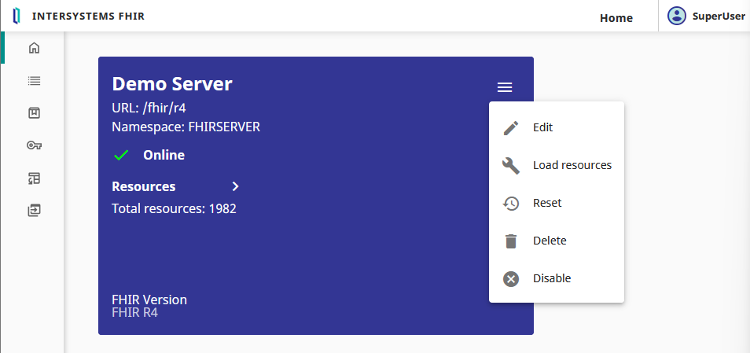
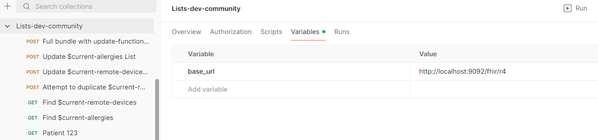

# Demo for Manipulating Lists in FHIR with $find and $update-functional 

Before starting, make sure you have installed:
* Postman
* Docker Desktop 

## Spin up InterSystems FHIR Server with Docker

```
docker run --rm --name intersystems-fhir-container -d --publish 9091:1972 --publish 9092:52773 intersystemsdc/irishealth-community:latest
```
```
docker exec -it intersystems-fhir-container iris session iris
```
```
USER>zpm "install fhir-server -D InteractionsStrategy=JsonAdvSql -D AddTestData=0"
```

Once the compilation steps complete, access the FHIR Server Management Portal at: http://localhost:9092/csp/fhir-management/index.html#/home

Log in with credentials: SuperUser / SYS.

## Add the new functional list configuration

Click the hamburger icon on your R4 FHIR Server and select "Edit".



Open the Interactions Strategy Settings and enter your new functional list name: `$current-remote-devices:patient:Patient`


Click Save and wait for the server update to complete.

## POST the sample data with Postman

Import the [List demo Postman collection](./postman_collection/Lists-dev-community.postman_collection.json) to your Postman environment.

Update the base_url environment variable to your FHIR endpoint: `http://localhost:9092/fhir/r4`



Run the POST request "Full bundle with update-functionals"