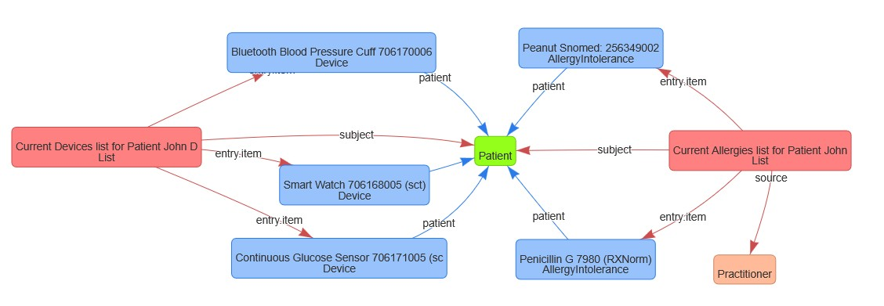
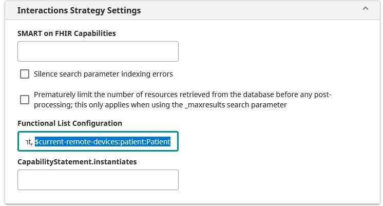

# Manipulating Lists in FHIR with $find and $update-functional 

Since IRIS for Health 2025.1, InterSystems has supported advanced operations for searching, updating, and maintaining Lists on FHIR Servers. With these tools, developers can easily and securely design applications for Medication Management, Allergy References, Device Monitoring and more...

[Instructions to try out are here!](./Instructions.md)

## What is a List in FHIR?

Lists are ordered collections that can relate clinical data (allergies, medications, procedures), workflows, organizational resources, or anything else in a health system.

Lists differ from Groups or Bundles since they are designed to be dynamic; items can be easily added, removed, or marked as 'current', and the contents of a List have specific business meaning.



## What is a Functional List?

A functional list, also called a current resource list, is a List populated with the subset of relevant information that is currently in use. Functional lists act as a single source of truth for a current state.

For example, a patient’s $current-problems functional list includes only those injuries and illnesses that the patient is suffering; this list would not include illnesses and injuries from which the patient has fully recovered. Each functional list is specific to a particular subject resource, usually a Patient.

By default, InterSystems FHIR Server provides support for: $current-problems, $current-medications, $current-allergies, and $current-drug-allergies. Details for these particular lists can be found in the official FHIR specification.

 
## Designing a new Functional List for remote medical devices:

Suppose I want to track all remote monitoring devices currently in use by a Patient. These could be wearables (smart watches, fitness bands, or patches), blood pressure cuffs, glucose monitors, or permanent implanted devices, such as pacemakers.

To achieve this, I'll define a new class of functional list: $current-remote-devices. This is not a part of the FHIR spec, but Lists are customizable to an organization's needs and we'll demonstrate how InterSystems FHIR Server support this.

My $current-remote-devices lists will be composed of R4 Device resources, but you can just as easily perform this in FHIR R5 and R6 versions as well. Here is an example for my Patient, John Doe:

```
{
    "resourceType": "List",
    "id": "1",
    "text": {
        "status": "generated",
        "div": "<div xmlns=\"http://www.w3.org/1999/xhtml\">\nCurrent Devices list for Patient John Doe</div>"
    },
    "status": "current",
    "mode": "working",
    "title": "Current Remote Monitoring Devices",
    "code": {
        "coding": [
            {
                "system": "http://example.org/fhir/list-codes",
                "code": "current-remote-devices",
                "display": "Current Remote Monitoring Devices"
            }
        ],
        "text": "current-remote-devices"
    },
    "subject": {
        "reference": "Patient/123"
    },
    "date": "2025-11-28T14:12:00Z",
    "source": {
        "reference": "Device/abc123",
        "display": "Remote Monitoring Enrollment Order"
    },
    "entry": [
        {
            "item": {
                "reference": "Device/1",
                "display": "Smart Health Watch"
            }
        },
        {
            "item": {
                "reference": "Device/9",
                "display": "Continuous Glucose Sensor"
            }
        },
        {
            "item": {
                "reference": "Device/4",
                "display": "Bluetooth Blood Pressure Cuff"
            }
        }
    ]
}
```

To make sure that my FHIR Server can understand this new class of functional list, I need to provide some information in the configuration settings. In this case, I will add $current-remote-devices:patient:Patient to my FHIR Server's interactions strategy settings.



The functional list configuration is versatile, and in this case, will allow me to search my $current-remote-devices lists using the patient:Patient search parameter. You can easily define other functional list configurations based on the default List search parameters like:
|Configuration |Searches On |Description |
|---------------------------|---------------------------|---------------------------|
|$current-remote-devices:patient:Patient| Lists by patient parameter| Can be used for maintaining and finding current remote devices assigned to a patient|
|$care-team:patient:Patient |Lists by patient parameter|Can be used for tracking and contacting a patient's care team, such as PCPs, Cardiologists, Home Health Specialists, or Therapists.|
|$source-current-allergies:source:Practitioner|Lists by Practitioner source|Can be used to find current-allergies submitted by a specific Practitioner|
 
## Creating the functional list:

With this configuration complete, we can now submit the Functional List using a specialized operation, $update-functional: 

```
POST {{base_url}}/List/1/$update-functional?for=123&name=\$current-remote-devices
```

Or as part of a bundle: 

```
{
    "resourceType": "Bundle",
    "type": "transaction",
    "entry": [
        "resource": {
            "resourceType": "List",
            "id": "1",
            ...
            "subject": {
                "reference": "Patient/123"
            }
            ...
            "entry": [...]
        },
        "request": {
            "method": "POST",
            "url": "List/1/$update-functional?for=123&name=\\$current-remote-devices"
        }
    ]
}   
```

Note the escape-characters (\\) required in both URLs.

$update-functional is an operation unique to InterSystems FHIR Server, specifically designed to allow flexible creation and modification of Lists that are current. As device feeds are onboarded or decommissioned, we can guarantee that John Doe's $current-remote-devices List has a single source of truth with this operation - each functional list is uniquely determined by only two parameters:

    for : this is the Patient or Source ID for the functional list
    name : this is the type of functional list

As expected, it is impossible to have two $current-remote-devices lists for a single patient.
 
## Searching for functional lists:

The $find operation is designed to search only functional lists by Patient ID and List Type. This allows for simplified retrieval of up-to-date information, such as allergies, remote devices, conditions, or care teams currently in use by a single patient.

```
GET {{base_url}}/List/$find?patient=123&name=\$current-remote-devices
```

 
## Try it yourself!

The sample data, requests, and demo instructions can be found on GitHub: 
 
​